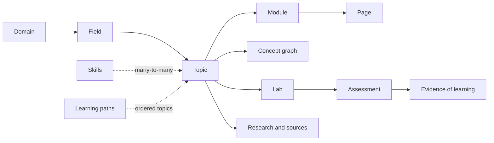

# Learning Harness Redesign

> **Start here:** this is an interactive redesign guide for turning DeepLearn from a well-governed single-page publisher into a scalable learning system for complex software and AI topics.

## The 60-second version

The repository has strong instincts:

- research remains separate from presentation;
- primary sources and version boundaries matter;
- incremental changes preserve earlier work;
- learning should be visual, practical, and reviewable;
- browser-local progress is honestly described.

The problem is the shape enforced by the harness:

- every research topic gets the same flat six- or seven-file package;
- every visual topic is forced into exactly one learning page;
- topic identity and page identity are the same field;
- coverage counts headings and anchors rather than objectives and evidence;
- configuration, prompts, validators, and the Astro app describe different systems;
- learner activity is mistaken for demonstrated mastery.

The redesign is therefore not “write better prompts.” It is:

1. model topics as many-page learning structures;
2. make the schema the source of truth;
3. plan concepts and assessments before prose;
4. validate objectives, evidence, routes, and learning outcomes;
5. use multiple agents only after those contracts exist.

## What is implemented in this worktree

The first migration phase is now real, not only documented:

- `.agents/` is the single canonical home for configuration, skills, policies, workflows, templates, contracts, shared parsers, validators, coverage maps, evals, and CLI entrypoints.
- `topicId` is separate from `pageId`; a topic can have one overview plus focused module, deep-dive, practice, and review pages while preserving stable routes.
- The Astro schema, research validator, visual validator, and heading-anchor implementation share one contract and one parser.
- Stable domain/field/skill/tool IDs are checked against `.agents/registry/taxonomy.json`; validators expose machine-readable JSON where supported.
- Research scaffolding is atomic and mode-aware: quick/review packages do not inherit deep implementation files that their own links do not provide.
- `doctor` now checks index drift, orphan research/presentation artifacts, stale config consumers, and the single-home harness layout without repairing state.
- `scripts/deep-learn.mjs` and `scripts/deep-learn-visual.mjs` remain compatibility entrypoints; new automation uses `.agents/bin/`.

The diagnosis tables below intentionally describe the pre-consolidation baseline. The MCP research files remain deleted in this worktree and are not restored by this migration; their orphaned visual page and coverage map are therefore reported as a known follow-up decision.

## Choose your path

Do not read every chapter linearly.

| If you want to… | Start with | Time |
| --- | --- | ---: |
| Understand the core problem | [Why the current harness fights the learner](modules/01-current-diagnosis.md) | 6 min |
| Design the knowledge structure | [Domains, fields, skills, topics, modules, and pages](modules/02-content-ontology.md) | 8 min |
| Fix one-page publishing | [The topic–module–page model](modules/03-topic-module-page-model.md) | 8 min |
| Redesign the learning flow | [From request to retained competence](modules/04-learning-lifecycle.md) | 8 min |
| Engineer the harness | [Contracts, orchestration, and quality gates](modules/05-harness-architecture.md) | 10 min |
| Improve the Astro experience | [Routing, interaction, accessibility, and progress](modules/06-astro-learning-experience.md) | 8 min |
| Use multiple agents safely | [The multi-agent operating model](modules/07-multi-agent-orchestration.md) | 7 min |
| Execute the change | [Migration roadmap and decision playbook](modules/08-migration-roadmap.md) | 9 min |

## The three recommended learning paths

### Path A — Understand the architecture

1. [Current diagnosis](modules/01-current-diagnosis.md)
2. [Content ontology](modules/02-content-ontology.md)
3. [Topic–module–page model](modules/03-topic-module-page-model.md)
4. [Harness architecture](modules/05-harness-architecture.md)

### Path B — Improve pedagogy

1. [Learning lifecycle](modules/04-learning-lifecycle.md)
2. [Astro learning experience](modules/06-astro-learning-experience.md)
3. [Hands-on redesign workshop](exercises.md#redesign-workshop)
4. [Retrieval guide](revision.md)

### Path C — Implement the redesign

1. [Implementation blueprint](implementation.md)
2. [Migration roadmap](modules/08-migration-roadmap.md)
3. [Decision playbook](modules/08-migration-roadmap.md#keep-change-kill-playbook)
4. [Research and implementation plan](research-plan.md)

## The target in one picture

The important distinction is:

- **research files preserve evidence;**
- **modules organize learning;**
- **pages reduce cognitive load;**
- **labs and assessments produce evidence of competence.**

## What is worth keeping

| Keep | Why it is valuable |
| --- | --- |
| Research/presentation separation | Prevents polished summaries from becoming accidental truth |
| Primary-source and version discipline | Makes fast-moving technical material auditable |
| Untrusted-content boundary | Treats web and repository instructions as data |
| Incremental preservation policy | Protects hand-authored explanations and findings |
| Deterministic validation concept | Catches structural failures early |
| Local-first progress disclosure | Avoids pretending browser state is synchronized |
| Visual explanation rules | Encourages diagrams that answer concrete questions |

## What must change

| Change | Current problem | Target behavior |
| --- | --- | --- |
| Research packaging | Mandatory flat files for every mode | Proportionate modules plus shared evidence and assessment artifacts |
| Visual cardinality | Exactly one page per topic | Exactly one overview plus one or more child pages |
| Identity | `learning.id` represents topic and page | Separate `topicId`, `pageId`, and `role` |
| Coverage | Research heading → existing anchor | Objective → concept/evidence → page → assessment |
| Taxonomy | Hardcoded mixed-level categories | Generated domain, field, skill, and path registry |
| Review routing | “Review” matches two skills | Explicit intent router and write ownership |
| Validation | Prose often claims stronger enforcement than code | Shared schemas, cross-layer graph checks, CI |
| Progress | Topic button and question self-rating | Objective evidence, labs, confidence, and local export/import |

## Interactive checkpoint

Why is “make the prompt more detailed” not the first fix?

Because the current validator explicitly rejects more than one learning page. A better prompt cannot produce a legal three-page topic until the schema and validator represent a topic with multiple pages.

Does this proposal mean every topic must become a large site?

No. A small quick-reference topic may remain one overview page. The invariant should be “one overview plus zero or more focused child pages,” not a mandatory large page count. Deep, production, and codebase topics split when they have independent objectives, assessments, or source studies.

Why add labs if the repository already has exercises?

Markdown exercises describe possible work. Labs produce durable evidence: code, tests, a pinned commit, a failure reproduced, or an architecture decision. The review system needs evidence, not only prompts and self-ratings.

## The first implementation decision

Do not start by migrating every note.

Start by changing the contract:

1. separate `topicId` from `pageId`;
2. allow one overview plus multiple pages;
3. require objective and assessment IDs;
4. add a topic manifest;
5. build multi-page fixtures;
6. then pilot MCP and one small legacy topic.

See [Implementation blueprint](implementation.md) for the proposed schemas and commands.

## Package navigation

- [Research plan](research-plan.md) — scope, questions, evidence, and stop conditions
- [Master agent prompt](AGENT_MASTER_PROMPT.md) — reusable tool-agnostic prompt for agents
- [Implementation blueprint](implementation.md) — target architecture, schemas, commands, gates, and migration mechanics
- [Exercises and workshop](exercises.md) — interactive architecture and review exercises
- [Retrieval guide](revision.md) — progressive active recall and self-assessment
- [Repository analysis](repositories.md) — inspected architecture and reading itinerary
- [Source ledger](sources.md) — official and repository evidence

## Validation record

- Deterministic validation: passed with `node .agents/bin/deep-learn.mjs validate learning-harness-redesign --strict`
- Repository-wide validation: passed with `node .agents/bin/deep-learn.mjs validate --all --strict`
- Astro production build: passed; existing plugin override and bundle-size warnings remain
- Semantic review: completed against the repository snapshot and cited official documentation
- Runnable prototype: intentionally excluded; this package defines the redesign rather than shipping the code
- Repository source inspection: completed for the files listed in `repositories.md`

## Update history

- **2026-09-25:** Created the interactive redesign package from the multi-role repository audit.
