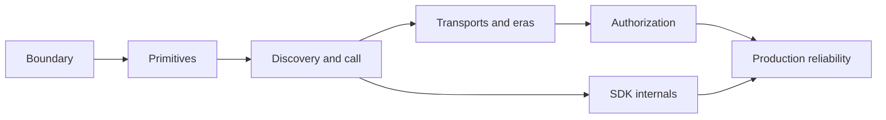

# Module 3 — The topic–module–page model

## Learning objective

After this module, you should be able to turn a broad subject into a dependency-aware set of modules and pages without creating either a mega-page or a pile of trivial fragments.

## The central rule

A topic is not a page.

A topic is a learning contract. A page is one delivery route for a focused part of that contract.

For a topic, the invariant should be:

```text
exactly one overview page
zero or more module/deep-dive/practice/review pages
one shared topicId
one unique pageId per page
```

A small topic can legally have only an overview. A complex topic should be able to have several pages without failing validation.

## Why module comes before page

If you split first by headings, you get a smaller version of the original filing cabinet. If you model the learning objectives and dependencies first, modules emerge from the learner’s path.

### Module criteria

A module should have:

- one coherent mental model;
- a named prerequisite set;
- a bounded set of concepts;
- at least one observable outcome;
- a worked example or source explanation;
- an aligned activity or assessment.

### Page criteria

A page should have:

- one dominant learning job;
- a short scan path;
- one primary explanation or mechanism;
- a useful next step;
- source and version links;
- a recall or practice moment near the relevant explanation.

A page may contain several headings if they serve one job. It should not contain every heading merely because the research file contains it.

## A page-planning algorithm

### Step 1: Write observable objectives

Use verbs:

- explain
- trace
- compare
- implement
- debug
- design
- evaluate

Bad:

> Understand tools.

Better:

> Trace a tool from discovery through validation, execution, and result handling, and classify the failure surface when the handler throws.

### Step 2: Extract concepts

For each concept, record:

- definition;
- mechanism;
- dependency;
- common misconception;
- failure mode;
- evidence.

### Step 3: Build the dependency graph



### Step 4: Cluster concepts

Group concepts when they:

- share prerequisites;
- teach one mechanism;
- can be assessed together;
- use the same worked example.

Split a cluster when it has independent objectives, distinct failure models, or a different audience question.

### Step 5: Assign page roles

Use a small set of page roles:

- `overview`
- `module`
- `deep-dive`
- `practice`
- `review`

Do not create a separate “quick” and “complete” duplicate of every page. Use summaries, progressive disclosure, and deep dives.

## Split signals

Split when a section has one or more of these:

- a distinct objective;
- a distinct assessment;
- a separate prerequisite edge;
- a separate search intent;
- a different visual representation;
- more than one substantial worked example;
- enough material to exceed a comfortable scan session.

Treat 8–12 minutes as a review signal, not a law. A tightly connected code walkthrough can be longer; a short concept page can still be unnecessarily fragmented.

## Merge signals

Merge when:

- the pieces cannot be named as separate learner outcomes;
- splitting repeats the same mental model;
- a concept and its only example cannot stand apart;
- the learner would need the same prerequisites repeated on every page;
- a “page” would be only a heading with one paragraph.

## Worked MCP decomposition

```text
model-context-protocol/
├── overview
├── foundations
│   ├── boundary
│   ├── primitives
│   └── protocol eras
├── tool-call
│   ├── discovery
│   ├── validation
│   ├── handler and result
│   └── failure surfaces
├── transports-and-security
│   ├── stdio
│   ├── Streamable HTTP
│   ├── authentication
│   └── origin and trust boundaries
├── production
│   ├── idempotency
│   ├── timeout reconciliation
│   ├── observability
│   └── alternatives
├── source-map
│   ├── SDK architecture
│   ├── pinned paths
│   └── source-reading exercise
├── practice
└── review
```

This is one valid decomposition, not a mandatory page count.

## Coverage without a giant page

Use three links instead of copying everything:

- the page teaches the mental model;
- the deep-dive or lab handles depth;
- the research route preserves complete evidence.

A source section can map to more than one destination:

```text
README.md#security-model
  → learning page: transports-and-security#trust-boundaries
  → research route: /research/.../README/#security-model
  → assessment: security-boundary-scenario
```

That is better than pretending a single anchor teaches every dimension.

## Interactive page-plan exercise

You are planning a TypeScript event-loop topic.

Write:

1. four objectives;
2. six concepts;
3. dependency edges;
4. two or three modules;
5. one page per module;
6. one place where a deep dive is justified;
7. one prediction question and one debugging lab.

<details>
<summary>What makes a good split?</summary>

A good split creates a new learning job, not merely a shorter file. If two sections always need to be read together to answer the same question, keep them together. If they can be learned, practiced, or searched independently, they may deserve separate pages.

</details>

## Checkpoint

<details>
<summary>Why not simply split the current MCP index at every `##` heading?</summary>

Because source and presentation have different purposes. A heading may be necessary for research completeness but not a meaningful learner page. Split by objective, dependency, assessment, and search intent—not by heading count.

</details>

## Takeaways

- A topic can contain many pages without duplicating identity.
- Modules come from objectives and dependency, not file size alone.
- Page count should be proportional to the subject.
- Overview, module, deep-dive, practice, and review are distinct roles.
- The old overview route can remain stable while content moves.

## Next

[Module 4 — From request to retained competence](04-learning-lifecycle.md)
