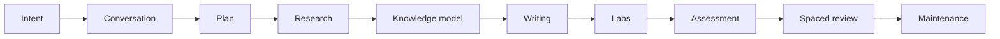

# Module 4 — From request to retained competence

## Learning objective

After this module, you should be able to design a learning workflow that distinguishes explanation, research, publication, practice, review, and maintenance.

## The missing distinction

The current harness often treats “teach me” as a request to create a complete research package. That is useful when the user explicitly asks for notes, but wrong for a normal explanation.

A learner may want to:

1. understand a concept now;
2. save a source-backed note;
3. publish a visual lesson;
4. practice an implementation;
5. be questioned on the topic;
6. maintain the topic when versions change.

Those are different workflows with different write permissions and success measures.

## The learning lifecycle



### 1. Intent

Classify the request before choosing a skill.

- `explain` → chat only by default;
- `research` → source-backed package;
- `publish` → visual presentation;
- `review` → learner evidence and gaps;
- `practice` → executable lab;
- `maintain` → freshness and updates.

### 2. Conversation

Explain the mental model, ask or infer prerequisites, and check the desired depth. Do not create files merely because the model has something useful to say.

### 3. Plan

Define outcomes, scope, evidence, and non-goals. A plan is a learning design artifact, not a list of file names.

### 4. Research

Gather primary evidence, version boundaries, implementation facts, and failure behavior. Keep source material separate from teaching claims.

### 5. Knowledge model

Extract concepts, dependencies, misconceptions, objectives, and assessments. This stage is currently missing and should precede prose generation.

### 6. Writing

Turn concepts into a default scan path and deeper pages. Explain before implementation. Interleave retrieval.

### 7. Labs

Create a small artifact that produces evidence. A lab is not merely a paragraph describing what the learner could build.

### 8. Assessment

Use more than recognition:

- explain a mechanism;
- predict output;
- debug a failure;
- implement a bounded change;
- design under constraints;
- transfer to a new scenario.

### 9. Spaced review

Schedule retrieval based on evidence and confidence. Keep the schedule honest; fixed intervals are an MVP, not an adaptive algorithm.

### 10. Maintenance

Revalidate version-sensitive claims, update affected modules, and preserve stable routes and personal work.

## Progressive disclosure

The four current access levels should map to different experiences:

| Level | Learner job | Best representation |
| --- | --- | --- |
| Quick Recall | Decide whether to invest | short definition and use condition |
| Visual Understanding | Build a mental model | mechanism, flow, diagram, worked example |
| Complete Understanding | Go deep | module/deep-dive and original research |
| Active Recall | Prove retrieval | interleaved checks and review page |

A topic index should not contain every deep dive inline. Use links and progressive disclosure.

## Interleaving practice

The current MCP page places all six recall checks at the end. A better page places a prediction immediately after a mechanism and places a broader delayed review later.

Example:

```text
Teach protocol discovery
  → learner predicts what happens when the tool is missing
  → reveal the behavior
  → continue to schema validation
  → learner predicts which surface reports invalid input
```

This is not just better quiz placement. It reduces the chance that the learner recognizes a familiar paragraph without reconstructing the mechanism.

## Learning evidence ladder

| Evidence | What it proves | What it does not prove |
| --- | --- | --- |
| Read the page | exposure | understanding |
| Answer a recall question | retrieval of a claim | transfer |
| Pass a prediction question | mechanism reasoning | implementation skill |
| Run a lab | applied capability in one context | broad mastery |
| Design a novel solution | transfer and judgment | long-term retention |
| Recall after delay | retention | automatic real-world performance |

The dashboard should show these distinctions instead of treating all progress as “learned.”

## Anti-overload rules

- Put the mental model before the source detail.
- Keep the default scan path short.
- Use diagrams only when they answer a question.
- Split by learning job, not arbitrary length.
- Give each page one next step.
- Keep research evidence available without placing it in the default path.
- Avoid repeating the same definition in overview, module, and review.

## Interactive lifecycle diagnosis

A user says:

> “Teach me Redis Streams, save it, make it visual, quiz me, and build a consumer-group lab.”

Break this into stages:

1. explain the bounded model;
2. research the versioned source package;
3. publish multi-page visual modules;
4. run recall and prediction checks;
5. create a lab with tests;
6. record objective evidence;
7. schedule review.

What should happen first? What can run in parallel? What must remain human-approved?

<details>
<summary>Suggested answer</summary>

Start with a short scope conversation and research plan. Evidence and prerequisite analysis can run in parallel after the plan is stable. Module authoring and lab design can proceed in separate ownership areas. Publishing waits for validated content. Quizzes should be derived from objectives, and the final learner evidence should remain separate from the research package.

</details>

## Checkpoint

<details>
<summary>What is the difference between a content page and a learning event?</summary>

**Answer:** A content page is a durable explanation or practice resource. A learning event is a learner interaction that produces evidence—retrieval, debugging, implementation, design, or transfer. The system needs both, but they should not be conflated.

</details>

## Takeaways

- Route intent before writing.
- Model objectives and dependencies before prose.
- Use pages for cognitive load, not for arbitrary section length.
- Interleave retrieval with teaching.
- Treat labs and assessments as evidence, not decoration.
- Separate content, learner state, and maintenance.

## Next

[Module 5 — Harness architecture and quality gates](05-harness-architecture.md)
