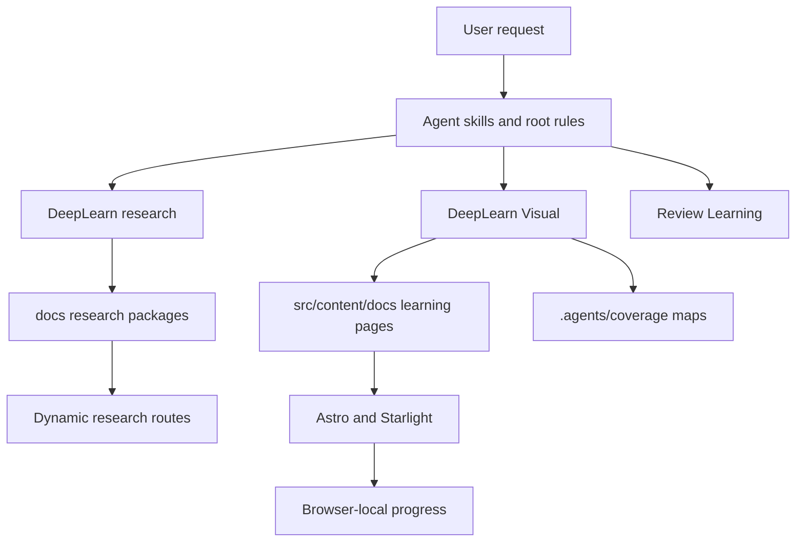

# Repository analysis: learning-notes

> The path inventory below records the pre-consolidation baseline that motivated the redesign. The active implementation now lives under `.agents/`; the historical `.doty/` and `.agent/` roots are intentionally not recreated.

## Selection method

The target of this redesign is the current repository itself. It was selected because the learning experience, research harness, validators, Astro content model, progress components, and agent-routing rules all interact in this codebase. External repositories were not needed to establish the current failure modes.

## Repository

- URL: <https://github.com/lakshay-goyal/learning-notes>
- Maintainer/organization: personal learning-notes repository
- Category: Astro/Starlight learning application and agent-assisted knowledge harness
- Purpose: research technical topics, preserve source-backed Markdown, publish visual learning pages, and track browser-local revision progress
- Inspected revision: `4d181b8`
- Verification status: `SOURCE_INSPECTED`

## Architecture

## Inspected paths and what they reveal

| Path | Role | Learning implication |
| --- | --- | --- |
| `AGENTS.md` | root routing and write boundaries | review/update triggers overlap and need an intent router |
| `.doty/workflow.md` | research lifecycle and modes | intent, depth, scope, and context are currently mixed |
| `.doty/config.json` | research defaults and required files | fixed core files force flat packages |
| `.doty/templates/` | research scaffolds | templates enforce boilerplate sections across modes |
| `scripts/deep-learn.mjs` | scaffold, index, and research validation | file table and topic discovery create the flat package |
| `scripts/deep-learn.test.mjs` | deterministic research tests | useful baseline but narrow scenario coverage |
| `.agent/skills/structure-knowledge/SKILL.md` | concept/page planning | asks for a hierarchy but does not define cardinality or split tests |
| `.agent/skills/generate-learning-page/SKILL.md` | page generation | singular page language matches the validator |
| `.agent/rules/learning-experience.md` | progressive disclosure | route-level disclosure is not represented in metadata |
| `scripts/deep-learn-visual.mjs` | visual inspection and validation | exact-one-page check is the central architectural blocker |
| `.agent/coverage/model-context-protocol.md` | source-section mapping | demonstrates link-only coverage inflation |
| `src/content.config.ts` | Astro content schemas | topic/page identity and taxonomy are under-modeled |
| `src/pages/research/[...slug].astro` | research archive routes | backlink is hardcoded to MCP |
| `src/components/learning/LearningDashboard.astro` | learner topic dashboard | assumes one content entry equals one topic |
| `src/components/learning/KnowledgeCheck.astro` | local recall state | stores ratings but not answer evidence |
| `src/components/learning/RevisionStatus.astro` | local topic state | manual learned state and duplicated storage logic |
| `astro.config.mjs` | Starlight plugins and navigation | hardcoded categories and broad plugin surface |
| `src/content/docs/ai-engineering/model-context-protocol/index.mdx` | only fully integrated visual topic | demonstrates the value and cost of the one-page model |
| `tools/git/merging-branches.mdx` | small legacy visual page | useful migration pilot outside the managed topic system |

## End-to-end trace: publishing a second topic

1. The user request is routed by overlapping skill descriptions.
2. Research scaffolding discovers only immediate `docs/<slug>/README.md` entries.
3. The topic receives the same flat core files.
4. The visual workflow reads the entire package and coverage map.
5. The generator creates a singular topic page because the template and skill are singular.
6. The validator rejects a second page sharing the topic.
7. The research archive derives a visual backlink only for MCP.
8. The dashboard counts managed pages, not aggregate topic manifests.
9. New category and field relationships must be added manually across Astro config and content.

This trace shows that the current system has no general second-topic path even though Astro itself supports nested routes.

## Observed failure conditions

- a deleted research package can leave an orphan visual page, coverage map, and index entry;
- a review Markdown file can become an unexpected source section in later visual coverage;
- relative learning links can escape both custom and Starlight validation;
- a config key can exist without affecting runtime behavior;
- a multi-page fixture cannot pass strict visual validation;
- a second research topic receives no automatic visual backlink;
- draft research can be rendered by the custom route without publication filtering;
- a static manual harness report can drift from actual skills and outcomes.

## Recommended reading itinerary

1. Read `README.md` and `AGENTS.md` for the promised architecture.
2. Read `.doty/workflow.md`, then `scripts/deep-learn.mjs:161-211` to compare policy with scaffolding.
3. Read `.agent/skills/structure-knowledge/SKILL.md`, then `scripts/deep-learn-visual.mjs:186-295` to compare planning with enforcement.
4. Read `src/content.config.ts`, `src/pages/research/[...slug].astro`, and the three stateful learning components.
5. Read the MCP coverage map and identify how many sections use link-only destinations.
6. Finish with `src/content/docs/tools/git/merging-branches.mdx` as a contrasting small page.

## Practical modifications to try

- replace the exact-one-page assertion with a multi-page fixture;
- add `topicId` and `pageId` to the learning schema;
- derive the research backlink from the learning collection;
- introduce a topic manifest and generated catalog;
- add a read-only doctor command;
- split MCP while preserving the overview route;
- add objective-to-assessment coverage;
- centralize progress storage behind a versioned adapter.

## Limitations

- The audit focused on architecture, content structure, harness enforcement, learning flow, and route behavior.
- Browser accessibility findings were source-inspected but were not re-tested in this package.
- Performance numbers from ignored build output were treated as directional rather than clean-build measurements.
- The redesign does not authorize changes to application dependencies or production configuration.
