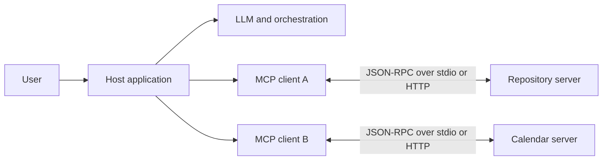
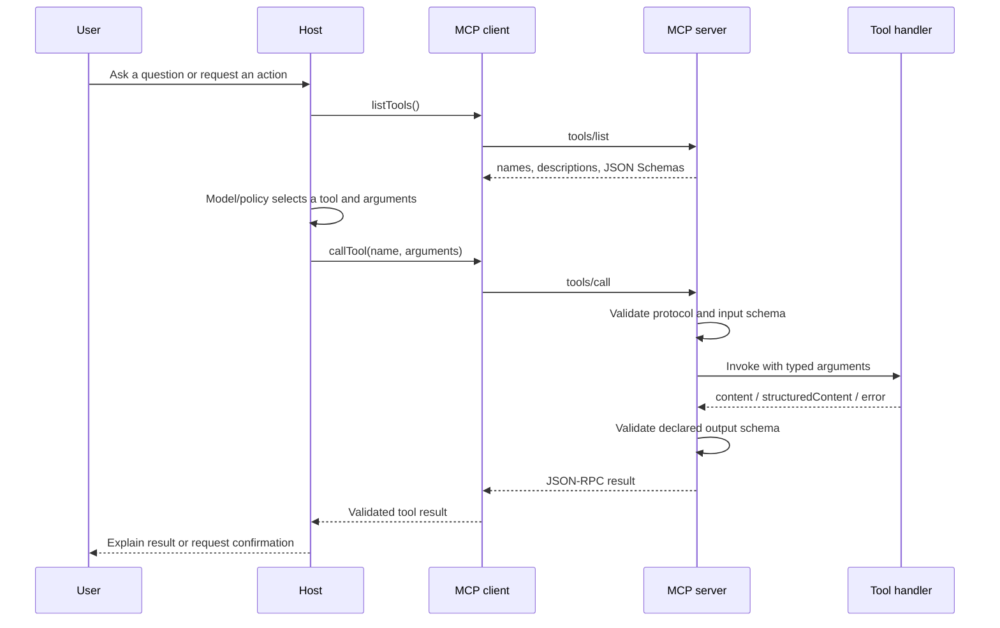
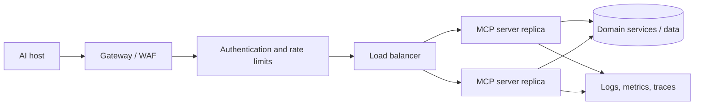

# Model Context Protocol

> Acceptance-study scope: a source-backed deep introduction to MCP's architecture, primitives, modern protocol lifecycle, transports, security boundary, TypeScript SDK implementation, and practical use. It is not an exhaustive treatment of every extension or OAuth branch.

## Overview

The Model Context Protocol (MCP) is an open, JSON-RPC-based contract between an AI application and services that offer data or actions. It standardizes the integration seam: a host can discover a server's tools, resources, and prompts; present appropriate capabilities to a model or user; invoke them; and receive typed results without every host/server pair inventing a bespoke adapter. The authoritative `2026-07-28` specification defines stateless, self-contained requests with per-request capabilities. ([MCP specification](https://modelcontextprotocol.io/specification/2026-07-28))

A useful mental model is “an application protocol for AI integrations,” not “an agent framework.” MCP defines how capabilities are described and invoked. It does not choose the model, plan tasks, decide what a user may authorize, implement your business logic, or make an unsafe tool safe.

## Learning objectives

After this package, you should be able to:

- distinguish host, client, server, model, and authorization responsibilities;
- trace tool discovery and invocation from JSON-RPC request to validated handler result;
- choose between stdio and Streamable HTTP for a concrete deployment;
- explain the breaking lifecycle boundary between the `2025-11-25` and `2026-07-28` protocol eras;
- build and test a minimal TypeScript v2 server/client pair;
- identify security and production responsibilities the protocol deliberately does not solve; and
- navigate the official TypeScript SDK source at a pinned commit.

## Prerequisites

- Basic TypeScript and asynchronous I/O
- Familiarity with HTTP and request/response protocols
- Basic JSON Schema and OAuth concepts for the security sections

## Recommended reading order

1. This lesson for the mental model and architecture.
2. [Implementation guide](implementation.md) for a tested v2 example.
3. [Repository analysis](repositories.md) to connect the model to real source.
4. [Exercises and projects](exercises.md) for active practice.
5. [Revision guide](revision.md) for recall and design questions.
6. [Research plan](research-plan.md) and [sources](sources.md) for scope and evidence.

## The boundary MCP creates

Without a common protocol, an AI host needs a custom connector for every calendar, repository, database, or internal API. Each connector invents discovery, schemas, invocation, errors, and lifecycle. MCP moves those recurring concerns into an interoperable contract:

The host owns the user experience, model interaction, policy, consent, and isolation. A client is the host-side protocol participant for a server. A server exposes a focused capability surface. This separation lets one server work with multiple conforming hosts, while the host retains control over which server output enters model context and which actions are permitted.

## Core primitives

The current specification defines three main server features. ([MCP specification](https://modelcontextprotocol.io/specification/2026-07-28))

| Primitive | What it represents | Typical use | Important boundary |
| --- | --- | --- | --- |
| Tool | An executable operation with described inputs and results | Search, create an issue, run a query | A description/schema does not establish authorization or safety |
| Resource | Addressable context or data a client can read | File content, schema, record, documentation | The host decides what enters the model's context |
| Prompt | A reusable templated message/workflow | Code-review or incident-analysis starter | It is guidance, not executable enforcement |

Clients can also support elicitation so a server-side operation can request additional user input. Optional extensions add separately negotiated behavior such as durable Tasks; extension support must not be assumed from core MCP support.

## A tool call end to end

This diagram separates protocol work from product policy. In the inspected TypeScript SDK, `McpServer` registers the `tools/list` and `tools/call` handlers, converts the declared schema for discovery, validates inputs before invoking the tool executor, validates structured output, and returns tool failures as `isError` results. The client exposes `listTools()` and `callTool()` and distinguishes tool-level error results from thrown protocol/SDK failures. ([pinned `mcp.ts`](https://github.com/modelcontextprotocol/typescript-sdk/blob/60321700871029401a2e3bed8fdf4f02c9ec3331/packages/server/src/server/mcp.ts), [pinned `client.ts`](https://github.com/modelcontextprotocol/typescript-sdk/blob/60321700871029401a2e3bed8fdf4f02c9ec3331/packages/client/src/client/client.ts))

## Transport is delivery, not meaning

The protocol semantics stay the same across transports. The standard bindings are:

- **stdio:** newline-delimited JSON-RPC over a subprocess's standard streams. The client launches and owns the server process. It fits local tools, editor integrations, and per-user isolation. Standard output is the protocol channel, so diagnostics belong on standard error.
- **Streamable HTTP:** each message is an HTTP POST to one endpoint; a response is JSON or a request-scoped server-sent-event stream. It fits remotely hosted, multi-client services and normal HTTP infrastructure.

The current transport specification explicitly treats transports as framing/delivery bindings and says request metadata remains authoritative in the message body, even when HTTP mirrors selected fields into headers. ([transport specification](https://modelcontextprotocol.io/specification/2026-07-28/basic/transports))

Choose stdio when the host can launch a local process and the capability should inherit that local boundary. Choose HTTP when independent deployment, remote access, centralized operations, or many clients matter. A local stdio process is not automatically trustworthy, and an HTTP endpoint is not production-ready merely because it is stateless.

## The protocol-version boundary

Do not combine tutorials from the two protocol eras silently.

| Concern | `2025-11-25` and earlier | `2026-07-28` |
| --- | --- | --- |
| Opening | `initialize` then `notifications/initialized` | No required handshake; optional `server/discover` |
| Version/capabilities | Negotiated and retained for the session | Carried in per-request `_meta` |
| Session | May use `Mcp-Session-Id` | Protocol session removed |
| Server needing user/model input | Server-initiated JSON-RPC requests | Multi Round-Trip Requests return `input_required`; client retries |
| Horizontal HTTP serving | Session routing/state may be required | Any instance can handle a self-contained request |

The release removed hidden transport session state, not all application state. A workflow can return an explicit state handle that the caller supplies on the next request. `server/discover` lets a client inspect supported versions and capabilities, but it is optional. ([2026-07-28 release notes](https://blog.modelcontextprotocol.io/posts/2026-07-28/))

There is a subtle SDK boundary: TypeScript SDK v2 supports the modern revision, but a manually constructed `Client`/`Server` remains on legacy behavior unless a modern serving/negotiation entrypoint is selected. For example, clients opt into probing with `versionNegotiation: { mode: 'auto' }`; high-level `serveStdio` and `createMcpHandler` handle both eras. ([SDK protocol migration guide](https://ts.sdk.modelcontextprotocol.io/v2/migration/support-2026-07-28))

## Failure and error model

Engineers must distinguish at least four failure surfaces:

1. **Transport failure:** process exits, HTTP deadline expires, stream closes, or framing is corrupted.
2. **Protocol/SDK failure:** unsupported method/version, malformed JSON-RPC, capability mismatch, or client-side deadline.
3. **Tool failure:** the handler ran and returned a result with `isError: true`; the model/host may respond to the described domain error.
4. **Business side effect ambiguity:** the caller times out after the server commits a write. A blind retry can duplicate the action.

The fourth case is why production write tools need idempotency keys, deduplication or operation-status lookup, and explicit retry semantics. MCP does not make a non-idempotent business operation safe.

## Security model

MCP is a high-trust integration boundary because tools can execute actions and resources can expose private data. The specification requires explicit user understanding/control and says tool descriptions should be treated as untrusted unless they come from a trusted server. ([security principles](https://modelcontextprotocol.io/specification/2026-07-28))

For HTTP, authorization is optional at the protocol level, but implementations that support it should follow the MCP OAuth profile. A protected MCP server acts as the resource server. Tokens belong in the `Authorization` header, must be audience-bound to the MCP server, and must not be passed through to downstream services. The current profile uses protected-resource and authorization-server discovery, favors Client ID Metadata Documents, requires PKCE-related flow protections, and defines step-up scope challenges. stdio integrations should obtain credentials from the environment rather than applying the HTTP authorization flow. ([authorization specification](https://modelcontextprotocol.io/specification/2026-07-28/basic/authorization))

Production controls still belong around the SDK:

- authenticate the principal and authorize each operation/record, not merely the connection;
- validate tool inputs again at domain boundaries and constrain output/data volume;
- require confirmation for destructive or costly actions;
- isolate local servers and sanitize environment inheritance;
- protect against prompt injection in resources and tool results;
- apply deadlines, concurrency limits, rate limits, and request-size limits;
- redact tokens and sensitive arguments from logs; and
- audit principal, server, tool, decision, outcome, latency, and correlation ID.

## Production engineering

The modern stateless HTTP core allows ordinary horizontal replication because any instance can serve a request. That removes session affinity but does not remove shared dependencies: authorization data, rate limits, business databases, queues, caches, and explicit workflow handles must still be consistent at their own boundaries.

A practical remote topology is:

The gateway can route/meter modern HTTP calls using mirrored method/name headers, but the body remains the protocol source of truth. Replicas should be disposable; durable jobs belong behind explicit task/queue semantics, and tool writes should surface stable operation identifiers. Monitor calls and failures by tool, validation rejection rate, authorization challenges, dependency latency, timeouts/cancellations, process exits for stdio, and result sizes. Load tests should use realistic tool mixes because a cheap `tools/list` call and a long external API tool have different capacity profiles.

## Alternatives and when not to use MCP

| Approach | Prefer it when | MCP advantage | Cost of MCP |
| --- | --- | --- | --- |
| Direct function/tool definitions in one model SDK | One application and one model provider own all integrations | Cross-host/server interoperability and separate deployment | Another protocol, lifecycle, and security boundary |
| Ordinary REST/OpenAPI client | Deterministic application code calls a known service | AI-oriented capability discovery and common result primitives | REST may be simpler for fixed non-AI integrations |
| Bespoke plugin contract | You control every client and need specialized semantics | Shared SDKs/ecosystem and portable servers | Bespoke behavior may not map cleanly to MCP primitives |
| Queue/workflow engine | Durable asynchronous execution and retries are the central problem | MCP can expose the workflow to hosts | MCP core is not a durable execution engine; use a queue behind it |

Do not add MCP merely to call an internal function from the same process. It becomes useful when the integration boundary, independent capability provider, host portability, or standardized discovery outweighs the additional operational surface.

## Related knowledge and next topics

- Prerequisites to add later: JSON-RPC 2.0, JSON Schema, OAuth resource servers
- Closely related: capability-based systems, plugin architectures, API gateways, prompt injection
- Advanced next topics: MCP authorization threat modeling, Multi Round-Trip Requests, Tasks extension, MCP gateway design, conformance testing

## Limitations and unresolved questions

- This acceptance package source-inspected one Tier 1 SDK, not every language implementation.
- It verifies the core v2 tool path but does not implement the complete HTTP OAuth profile.
- Industry evidence is limited to official maintainer release material; independent production postmortems were outside this acceptance scope.
- Extensions such as Tasks, MCP Apps, and Skills over MCP are identified but not taught in depth.
- Cost depends on the hosted tools and surrounding infrastructure; MCP itself does not define a billing model.

## Validation record

- Deterministic validation: passed in strict mode on 2026-09-21.
- Semantic review: objectives, versions, API examples, source paths, evidence labels, and limitations reviewed on 2026-09-21.
- Example execution: passed on Node.js `26.8.1` with TypeScript SDK server/client `2.0.0`, `tsx 4.20.5`, and `zod 4.6.5`; asserted tool result `42`.
- Repository source inspection: commit `60321700871029401a2e3bed8fdf4f02c9ec3331` inspected locally.

## Update history

- 2026-09-21: Initial DeepLearn acceptance package; verified the final `2026-07-28` protocol and TypeScript SDK v2 boundary.
