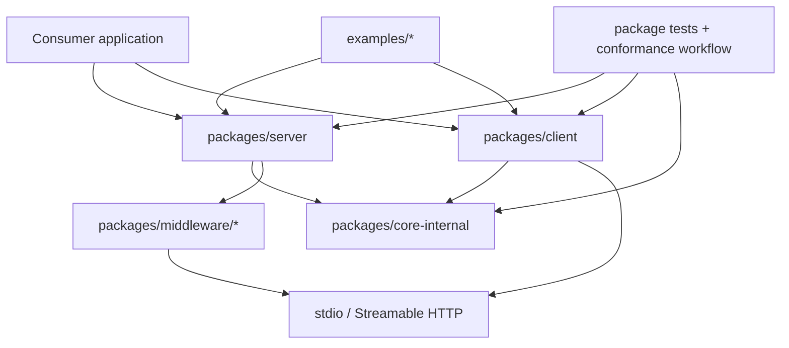

# Repository analysis: Model Context Protocol

## Selection method

The acceptance study needed an official, actively maintained implementation of the current final specification, with real client and server code, tests, examples, and a direct fit with TypeScript/Node.js. The official [Model Context Protocol TypeScript SDK](https://github.com/modelcontextprotocol/typescript-sdk) met those criteria. Inspecting one repository deeply was more useful than listing several language SDKs without tracing them.

## Repository: `modelcontextprotocol/typescript-sdk`

- URL: <https://github.com/modelcontextprotocol/typescript-sdk>
- Maintainer/organization: Model Context Protocol project (a Series of LF Projects, LLC)
- Category: official SDK/library and reference implementation
- Purpose: TypeScript client/server implementations, core protocol types/codecs, runtime middleware, documentation, examples, migration tools, and conformance integration
- Why relevant: it is the preferred-language Tier 1 SDK and implements the final `2026-07-28` revision while retaining legacy interoperability
- License/access: public; repository states Apache-2.0 for new contributions with existing code under MIT
- Inspected commit: `60321700871029401a2e3bed8fdf4f02c9ec3331`
- Commit date and subject: 2026-09-16, `feat(server): add request-time OAuth scope challenges (#1624)`
- Package line observed: split `@modelcontextprotocol/server`, `client`, `core`, and middleware packages at `2.0.0`
- Verification status: `SOURCE_INSPECTED`

This is an SDK, not a full production application. Its middleware and examples demonstrate protocol implementation patterns; they do not supply a product-specific authorization model, durable business workflow, or deployment platform.

## Architecture

- `packages/server` contains the high- and low-level server surfaces, request handlers, stdio and web-standard HTTP entries, auth-related middleware primitives, and server tests.
- `packages/client` contains connection/version negotiation, transport clients, OAuth helpers, response caching, high-level calls, and client tests.
- `packages/core-internal` owns shared protocol machinery, public types, per-era wire codecs and registries, validation, errors, and in-memory test transport.
- `packages/middleware` provides thin Node, Express, Fastify, and Hono adapters instead of moving business logic into framework layers.
- `examples` contains runnable paired clients/servers; `docs` is built from source-linked examples; `.github/workflows/conformance.yml` connects the implementation to protocol conformance tests.

## Verified paths and what to learn

| Path at pinned revision | Role | What to learn |
| --- | --- | --- |
| [`packages/server/src/server/mcp.ts`](https://github.com/modelcontextprotocol/typescript-sdk/blob/60321700871029401a2e3bed8fdf4f02c9ec3331/packages/server/src/server/mcp.ts) | High-level `McpServer`; primitive registries and handlers | How `tools/list` is derived, arguments/results are validated, and handler errors become tool errors |
| [`packages/server/src/server/server.ts`](https://github.com/modelcontextprotocol/typescript-sdk/blob/60321700871029401a2e3bed8fdf4f02c9ec3331/packages/server/src/server/server.ts) | Low-level server/protocol endpoint | Capability registration, negotiated version, request handlers, and modern-only behavior |
| [`packages/server/src/server/createMcpHandler.ts`](https://github.com/modelcontextprotocol/typescript-sdk/blob/60321700871029401a2e3bed8fdf4f02c9ec3331/packages/server/src/server/createMcpHandler.ts) | Web-standard HTTP entry | Body-first era classification, per-request server factory, request limits, headers, scope challenge seam, and what security remains outside the handler |
| [`packages/server/src/server/serveStdio.ts`](https://github.com/modelcontextprotocol/typescript-sdk/blob/60321700871029401a2e3bed8fdf4f02c9ec3331/packages/server/src/server/serveStdio.ts) | Stdio serving entry | How a connection is pinned to a modern or legacy era and how discovery probing behaves |
| [`packages/client/src/client/client.ts`](https://github.com/modelcontextprotocol/typescript-sdk/blob/60321700871029401a2e3bed8fdf4f02c9ec3331/packages/client/src/client/client.ts) | High-level client | `callTool`, discovery caches, header mirroring, output validation, error surfaces, and subscriptions |
| [`packages/client/src/client/versionNegotiation.ts`](https://github.com/modelcontextprotocol/typescript-sdk/blob/60321700871029401a2e3bed8fdf4f02c9ec3331/packages/client/src/client/versionNegotiation.ts) | Protocol-era negotiation | Auto probing, legacy fallback, and pinned negotiation policy |
| [`packages/core-internal/src/wire/codec.ts`](https://github.com/modelcontextprotocol/typescript-sdk/blob/60321700871029401a2e3bed8fdf4f02c9ec3331/packages/core-internal/src/wire/codec.ts) | Era-independent codec contract | Where per-era validation, envelope handling, result projection, and wire-only material are abstracted |
| [`packages/core-internal/src/wire/rev2026-07-28/registry.ts`](https://github.com/modelcontextprotocol/typescript-sdk/blob/60321700871029401a2e3bed8fdf4f02c9ec3331/packages/core-internal/src/wire/rev2026-07-28/registry.ts) | Modern method registry | How removed/available methods become explicit era membership and `Method not found` behavior |
| [`examples/tools/server.ts`](https://github.com/modelcontextprotocol/typescript-sdk/blob/60321700871029401a2e3bed8fdf4f02c9ec3331/examples/tools/server.ts) | Runnable tool server | One server factory served over stdio or HTTP, schemas, annotations, and structured results |
| [`examples/tools/client.ts`](https://github.com/modelcontextprotocol/typescript-sdk/blob/60321700871029401a2e3bed8fdf4f02c9ec3331/examples/tools/client.ts) | Self-checking client | Discovery assertions, calls, output checks, unknown-tool behavior, and transport choice |
| [`packages/server/test/server/serveStdio.test.ts`](https://github.com/modelcontextprotocol/typescript-sdk/blob/60321700871029401a2e3bed8fdf4f02c9ec3331/packages/server/test/server/serveStdio.test.ts) | Era/lifecycle tests | Legacy isolation, modern envelopes, discovery probe fallback, and unsupported-version errors |
| [`.github/workflows/conformance.yml`](https://github.com/modelcontextprotocol/typescript-sdk/blob/60321700871029401a2e3bed8fdf4f02c9ec3331/.github/workflows/conformance.yml) | Conformance automation | How protocol compatibility is tested beyond unit tests |

## End-to-end `tools/call` trace

1. **Consumer call.** `Client.callTool()` in `packages/client/src/client/client.ts` receives a tool name/arguments. In the modern era it may derive `Mcp-Param-*` mirror headers from a cached tool definition; it also prepares output-schema validation when discovery populated the cache.
2. **Transport and era.** stdio sends the JSON-RPC request over the pinned connection. HTTP reaches `createMcpHandler`, which reads/parses the body under a size bound, calls `classifyInboundRequest`, and selects modern versus legacy serving.
3. **Server construction.** The modern HTTP path invokes the consumer factory with request/era/auth context and receives an `McpServer` or low-level `Server`. A fresh instance per request is possible because the modern protocol carries its metadata per request.
4. **Pre-dispatch checks.** The HTTP entry checks required client capabilities and any schema-declared mirrored headers. Registered scope-challenge callbacks can produce a request-time authorization challenge. Token verification and origin/host policy are explicitly outside this entrypoint.
5. **Primitive dispatch.** `McpServer.setToolRequestHandlers()` has registered `tools/call` on the low-level server. It looks up the named tool and rejects a missing or disabled registration.
6. **Input validation.** `validateToolInput()` runs the Standard Schema validator against `request.params.arguments`; failure becomes an invalid-params protocol error that is converted into a readable tool error by the high-level handler.
7. **Business handler.** `executeToolHandler()` calls the registered executor with validated arguments and `ServerContext`.
8. **Output validation.** If an output schema exists, `validateToolOutput()` requires and validates `structuredContent` unless the result is already a tool error or an `input_required` continuation.
9. **Era projection and encoding.** The server delegates result projection/encoding to the selected wire codec so modern and legacy shapes do not leak into each other.
10. **Client completion.** The client receives a complete result (or its multi-round-trip driver handles `input_required`), applies available output validation, and resolves `callTool()`. Tool-reported failures remain `result.isError`; transport/protocol/SDK failures throw.

The key design is layering: high-level primitive registration is era-neutral; entrypoints classify lifecycle; per-era codecs own wire differences. This prevents every tool handler from branching on protocol revision.

## Failure conditions observed in source

- Invalid or unsupported protocol claims are rejected before a server instance handles the request.
- Missing client capabilities can fail at the HTTP entry.
- Unknown/disabled tools fail before user handler execution.
- Invalid inputs and declared structured outputs are rejected by schema validation.
- A modern-only method sent to the legacy registry, or a removed method sent to the modern registry, is absent and returns method-not-found behavior.
- A cold client tool cache can mean no output validation or mirrored parameter headers until discovery has populated the definition.
- stdio logs on stdout corrupt framing; subprocess death becomes a transport/connection failure.
- Auth, origin, host, rate, business authorization, and side-effect idempotency require surrounding application controls.

## Reading itinerary

1. Read `examples/tools/server.ts` and `examples/tools/client.ts` to establish the public API and expected behavior.
2. Read `packages/server/src/server/mcp.ts`, focusing on `setToolRequestHandlers`, `registerTool`, and input/output validation.
3. Read `packages/client/src/client/client.ts` around `callTool`, then `versionNegotiation.ts`.
4. Read either `serveStdio.ts` or `createMcpHandler.ts` according to your deployment; compare how each selects an era and instance lifetime.
5. Read `wire/codec.ts`, then the `rev2026-07-28/registry.ts` and matching legacy registry to see version differences isolated in code.
6. Read `serveStdio.test.ts`, `createMcpHandler.test.ts`, tool/server tests, and the conformance workflow.
7. Modify the tools example: add a declared output schema violation, then trace where the failure is created and how the client observes it.

## Practical modifications

- Add a `divide` tool and make division by zero a tool-level domain error rather than a thrown transport/protocol error.
- Add a write tool with an idempotency key and an operation-status resource.
- Run the paired example in both stdio and HTTP modes; capture which layer changes and which public tool code does not.
- Add a test proving a 2026-only method cannot leak onto a legacy-pinned connection.

## Limitations

- The inspected commit is five days before this study, but future commits may reorganize these paths.
- Source inspection focused on the tool call, transport/era boundary, and related tests; OAuth helpers, Tasks, prompts, resources, and every middleware adapter were not traced end to end.
- Passing SDK tests/conformance does not validate a consuming application's authorization rules or business safety.
- No claim is made that SDK source structure is identical across Python, Go, C#, or other implementations.
