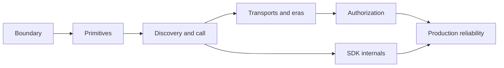

import { Aside, Card, CardGrid } from '@astrojs/starlight/components';
import QuickRecall from '../../../../components/learning/QuickRecall.astro';
import KnowledgeCheck from '../../../../components/learning/KnowledgeCheck.astro';
import RevisionStatus from '../../../../components/learning/RevisionStatus.astro';
import TopicHeader from '../../../../components/learning/TopicHeader.astro';

<TopicHeader
  category="Learning Systems"
  difficulty="Intermediate"
  version="Snapshot 42b3f13"
  prerequisites={['Content ontology']}
  researchHref="/research/learning-harness-redesign/modules/03-topic-module-page-model/"
/>

<RevisionStatus topicId="learning-harness-redesign" title="Learning Harness Redesign" />

<QuickRecall
  definition="The page model: one topic publishes exactly one overview page plus zero or more focused pages, split by learning job rather than by section length."
  problem="A topic whose content exceeded one page had two bad options: an unreadable mega-page, or no publishable form at all. The old contract offered only the first."
  mentalModel="Plan pages from objectives and dependencies, then name each page by the job it does. If you cannot say what question a page answers, it is not a page yet."
  takeaways={[
    'Objectives come first; pages are derived from them.',
    'A page is a cognitive-load unit, not a container for a chapter.',
    'No duplicate quick/complete pair of every page.',
  ]}
  whenToUse="When deciding how many pages a topic needs and what each one owns."
/>

## The central rule

> One topic, one stable `topicId`, one research package, one `overview` page, and
> zero or more `module`, `deep-dive`, `practice`, and `review` pages — each with a
> unique `pageId` and a unique route.

The invariant is "one overview plus zero or more", not a mandatory large page
count. A small quick-reference topic stays one page. Deep, production, and
codebase topics split when they have independent objectives, assessments, or
source studies.

## Why module comes before page

A module is a unit of content. A page is a unit of *delivery*. Conflating them
forces one-to-one structure and makes "split this" impossible to express.

The order that works:

```text
objective → concept → dependency → cluster → page
```

Modules are the clusters. Pages are the delivery. A module may become several
pages; a page may draw from several modules.

## The planning algorithm

### 1. Write observable objectives

Use verbs: explain, trace, compare, implement, debug, design, evaluate.

Use verbs that name an action. "Understand" names an experience, not a
demonstration:

```md title="Not assessable"
Understand tools.
```

```md title="Observable"
Trace a tool from discovery through validation, execution, and result handling,
and classify the failure surface when the handler throws.
```

The second one can become an assessment. The first one cannot.

### 2. Extract concepts

For each concept record its definition, mechanism, dependency, common
misconception, failure mode, and evidence. A concept without a misconception is a
definition; a concept without a failure mode has not been examined.

### 3. Build the dependency graph



### 4. Cluster concepts

Group when they share prerequisites, teach one mechanism, can be assessed together,
or use the same worked example.

Split when they have independent objectives, distinct failure models, or serve a
different audience question.

### 5. Assign page roles

| Role | Answers |
| --- | --- |
| `overview` | What is this, why does it matter, when should I use it? |
| `module` | How does mechanism X work, step by step? |
| `deep-dive` | What are the internals, the source layout, the edge cases? |
| `practice` | How do I build or configure it? |
| `review` | Can I retrieve and apply this without looking? |

<Aside type="note" title="Do not build duplicates">
  A `quick` and a `complete` copy of every page doubles the maintenance burden and
  guarantees drift. Use summaries, progressive disclosure, and deep dives instead.
</Aside>

## Split signals

Split when a section has any of these:

- a distinct objective
- a distinct assessment
- a separate prerequisite edge
- a separate search intent
- a different visual representation
- more than one substantial worked example
- more material than one scan session should hold

Treat 8–12 minutes as a review signal, not a law. A tightly connected code
walkthrough can run longer; a short concept page can still be fragmented.

## Merge signals

Merge when:

- the pieces cannot be named as separate learner outcomes
- splitting repeats the same mental model
- a concept and its only example cannot stand apart
- the learner would need the same prerequisites repeated on every page
- a "page" would be a heading with one paragraph

## What this topic did

| Page | Chapters | Job |
| --- | --- | --- |
| Overview | README | decide whether to invest |
| Diagnosis | 01 | explain the root causes |
| Ontology | 02 | classify knowledge |
| Page model | 03 | plan a page set |
| Lifecycle | 04 | route an intent |
| Gates | 05, 07, 08 | decide what stops this breaking |
| Practice | exercises | apply it |
| Review | revision | retrieve it under delay |

Chapters 05, 07, and 08 became one page because all three answer one reader
question. Chapter 06 became no page: it documents the presentation layer, which
now lives in `.agents/` rather than being taught as a topic.

## Test yourself

<KnowledgeCheck
  topicId="learning-harness-redesign"
  questionId="page-model-check"
  category="application"
  prompt="A topic has three sections with distinct objectives, distinct failure models, and different prerequisite edges. How many pages, with which roles?"
  answer="Three child pages beyond the overview. Each independent objective with its own assessment and its own prerequisite edge is a separate delivery unit — a module page each. The overview keeps the orientation and the three takeaways."
  misconception="Keeping them together because they share a topic, which produces the mega-page this model exists to prevent."
  reviewHref="#split-signals"
/>

<KnowledgeCheck
  topicId="learning-harness-redesign"
  questionId="merge-signal"
  category="understanding"
  prompt="You split a topic into four pages, and each page now repeats the same prerequisites paragraph. Which signal did you miss?"
  answer="The merge signal: splitting repeats the same mental model. If every page needs identical prerequisites, the split was by section length rather than by learning job. Recluster by objective."
  misconception="Treating repetition as an unavoidable cost of multi-page structure."
  reviewHref="#merge-signals"
/>

## Where next

<CardGrid>
  <Card title="Learning lifecycle" icon="cycle">
    Route an intent to a workflow and name its success measure.
    [Next →](../lifecycle/)
  </Card>
  <Card title="Back to the overview" icon="home">
    [Overview →](../)
  </Card>
</CardGrid>

Full chapter: [Module 3 · Topic-module-page model](/research/learning-harness-redesign/modules/03-topic-module-page-model/)